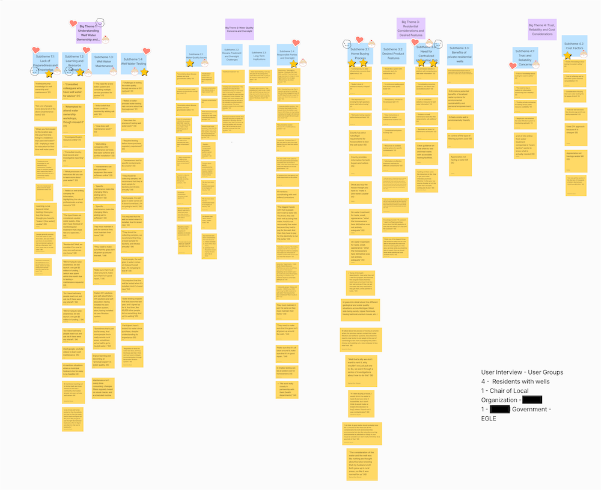

## ⏱️ Tldr;

Conducted **foundational research** study to scope an ambiguous problem.

Formulated design statement:
 **How might we empower residential homeowners in the process of finding trusted resources about well water quality?**

**Designed an all in one web application for private well owners** in the state of Michigan to find trusted resources and keep track of their water quality.

<h3 class="text-base-content">Methods Used:</h3>
<ul class="marker:base-neutral-content">
<li>User Journey</li>
<li>UI Design (Framer)</li>
<li>User/Stakeholder Interviews</li>
<li>User Testing (virtual, unmoderated)</li>
<li>Affinity Analysis (Figjam)</li>
<li>Secondary Research</li>
</ul>

## Jump to

1. [Background and Project Goals](#background-and-project-goals)
2. [Exploratory Research and Scoping](#exploratory-research-and-scoping)
3. [Initial Design](#initial-design)
4. [User Testing: Evaluation of Initial Design](#evaluation-of-initial-design)
5. [Final Design](#final-design)
6. [Personal Reflection](#reflection-and-things-learned)

## Background and Project Goals

- I completed this project as part of a capstone course in UX Research and Design for my Masters degree in Information Science at the University of Michigan School of Information (UMSI).

 - The team that worked on this project was made up of myself and four other U of M students. Our responsibility in this course, taught by Aalap Dashi, was to use all of our design skills to **address an ambiguous problem**. Because of this, we were allowed to choose any project that interested us.

 - This project **won first prize** in Residential Masters captsone projects at the UMSI 2024 Student Expo.

**Our team started with this fuzzy goal: "How can we help improve access to water quality in Michigan?"**

 -  We chose this goal primarily because of its social impact given the **importance of water quality to the state of Michigan** (e.g the state's proximity to The Great Lakes and the previous water quality issues and inequities such as the Flint Water Crisis.)

## Exploratory Research and Scoping

### Water Quality Information Access in Michigan: An Ambiguous Design Problem

 As a team, we started this project conducting secondary research on issues related to water access and quality in the state of Michigan.

### Secondary research on water issues in the state of Michigan

  - We consulted government websites, news articles, and previous academic research. More broadly, we examined non profit and government websites about water quality and access to water to get a sense of what resources were available to users, and to identify previous design solutions within the problem space. Because water conservation and access was the theme for that year at UMSI, we also had access to previously conducted interviews with subject matter experts.

   - **Outcome: Identified major water quality and access issues in South East Michigan, in particular Dioxane contamination. Indentified potential group of users– Michigan Private Well Users.**

### Private Well Owners Needs Evaluation

#### Method: 60 Minute User interviews
  - 4 Private well owners
  - 2 Subject matter experts (From state government and local water quality advocacy group)

Three group members including myself, conducting an interview with a subject matter expert of dioxane contamination in SE Michigan.

#### We used an **affinity analysis** to analyze our data.
- After identifying key themes from the data, group members voted on how which problems we should focus on and from there created a "How Might We" design statement.

- Our team experimented with generative AI (Claude) to help us with inital data analysis. We fact checked and personally evaluated all of that analysis.

A screenshot of our team's affinity analysis.

### Key Insights from Interviews:

1. Participants described having to do their own research to understand how to treat their well water. They identified a **lack of trustworthy, centralized information** on private well water quality and taking care of wells.

2. **Participants do not necessarily think about their well water everyday, but they consider water quality an important and emotionally resonant issue.** Some participants described feeling "scared" or very concerned about dioxane contamination in Michigan.

4. Participants said that they most needed information about their well water **during the home buying process and after they purchased their new home**.

### 💥 Research Impact :
- Developed design statement: **How might we empower private well users in the proccess of finding trusted resources about well water quality?**

- For our initial design, we experimented with unique ways of disseminating water quality information to make it easier for users to stay on top of well maintence. This information was incorporated into our user story.

- After feedback on our initial design– we pivoted on our previous design for dessiminating information and **turned our user story into a user journey that describing a specific use case: a new home owner**. We chose this scenario based on data from these interviews.

## Initial Design

**User story:**

A michigan resident concerned about water quality, particularly dioxane, recieves a utility/water bill or property tax statement with a QR code. Scanning the code leads them to the Michigan Water Quality Dashboard, where they can choose to explore an interactive map displaying water quality data (including dioxane) by location or browse a commmunity forum filed with posts from verified Michigan residents about their water.

**Breadboard Map:**

 The breadboard map and user story we created for our initial design concept.
 
 

## Evaluation of Initial Design

**Method:**
In order to evaluate our initial design we saught feedback from our original 6 participants.

- Each participant recieved an approximately five minute video of one of the team members walking through the user story and bread board map.

- Participants were instructed to record (through video, writing, pen and paper notes and doodles, anything) their initial impressions of our design.

### Key Insights from Evaluation:

1. Participants were especially excited by the idea of a water quality dashboard, map and the design's social features.

2. One of our subject matter experts was concerned about user privacy and stigmatizing certain communities/neighborhoods with regards to the water quality map.

3. Participants were unsure about the logistics of recieving the QR code–saying they didn't recieve water or utility bills.

### 💥 Impact:

- Design Pivot: **Focus first on homeowners**, a specific user subsection of private well water users.
  - Feedback from participants on our information dissemination design indicated that our attempt to include all possible private well users (renters, property managers, etc. ) wasn't working– **all of our private well users were homewners so we narrowed our scope to focus on this group** because we had the most data about their needs.

  - To express this change, we created a **new user journey** that described a possible use case.

## Final Design

### Key Features

- **Central hub** for resources on water quality and well water testing

- **Community map** that shows water qaulity data:
  - Publically available data from trusted (state) resources
  - Crowd sourced data from local community

- Account for users to **track water testing data for their well**:
  - Account, identity, and testing verification required to participate shared data map
  - Contributing to water testing results map is completely

### Journey Map

 The journey map we developed to create our final design.
 
 

### Preliminary UI Design

 Three screens for our Mi Safe Water prototype: the home screen, the screen for users to track their water quality, and the community water quality map.

#### Want to see more? Check out the basic prototype here: https://jaags.framer.ai/.

- Because we wanted to experiment with emerging technology, our team chose to use Framer's AI feature to help build this site.

## Reflection and things learned

- **Working with a research constraint: particants with similar backgrounds**

  Though we sought paritcipants from multiple sources in an attempt to get a diverse array of participants, our four private well users were all homeowners. We attempted to address this constraint through the additional secondary research and conversations with our SME participants, but the understanding we had of non-home owner well users was incomplete. Ultimately, we narrowed to scope of the project by focusing our design on the needs of homeowners.

- **The power of story.**

  The direction for our design and its key features and the user flow became much clearer once we articulated our data based user journey. This user journey and along with our focus on social impact (raising awareness of water quality issues, increasing access to information) were noted by judges and attendees of the UMSI Expo as particularly compelling.

